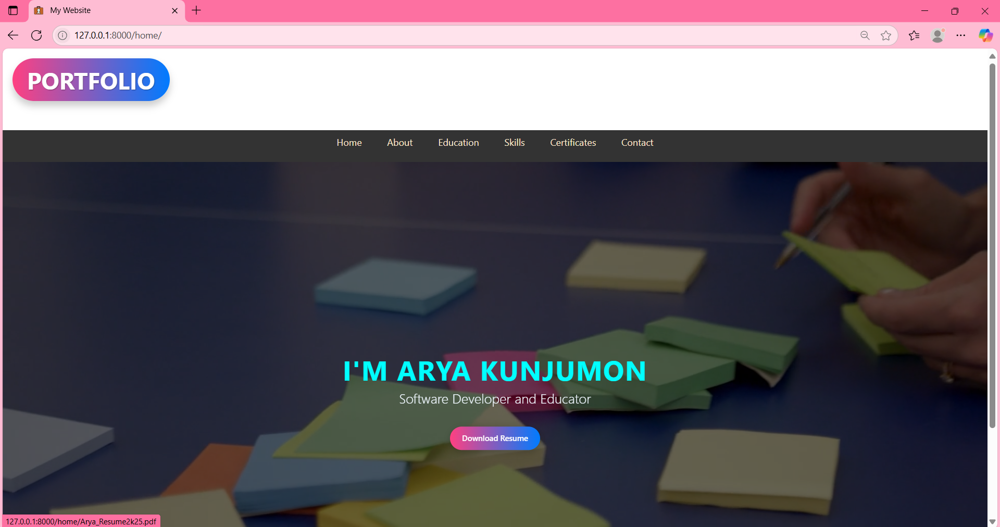
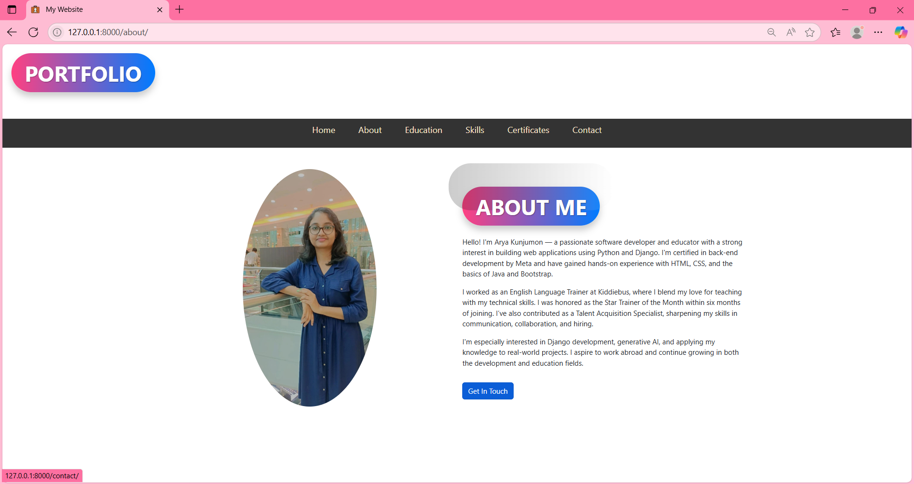
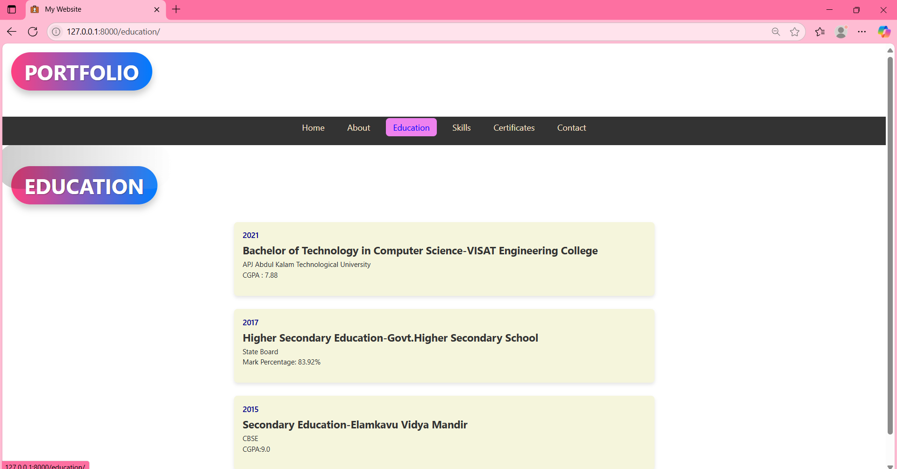
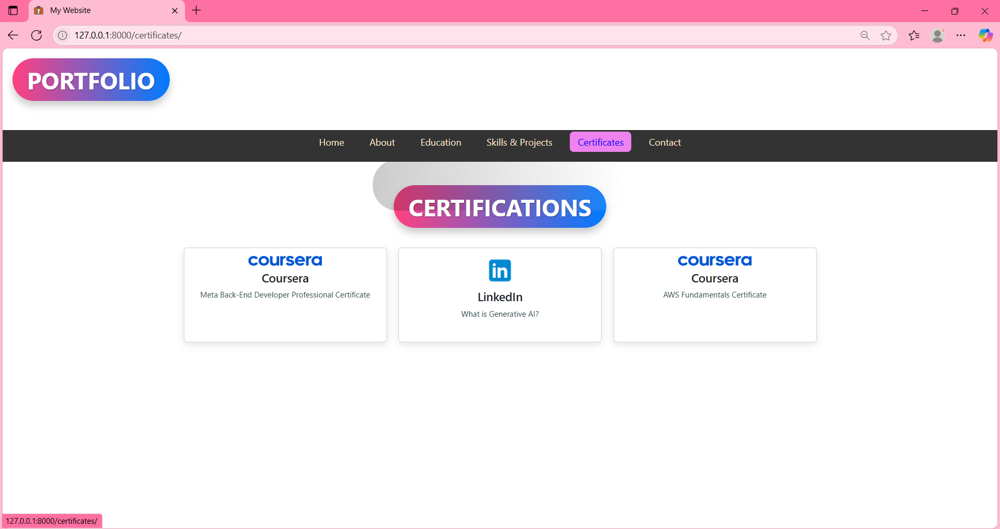
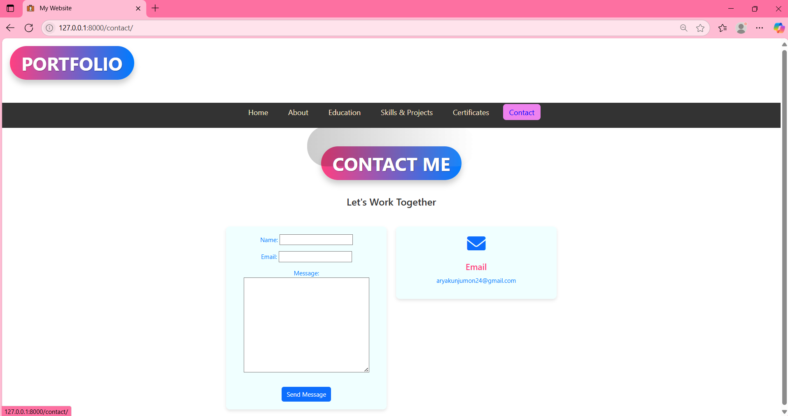

# 🧑‍💻 Personal Portfolio Website

A personal portfolio web application built using Django and Bootstrap to showcase projects, certifications, and skills. The site features a clean layout, responsive design, and an organized display of content to highlight technical proficiency.

---

## 💻 Technologies Used

* Python
* Django
* HTML & CSS
* Bootstrap

---

## 🔑 Key Features

* ✅ Responsive portfolio layout
* ✅ Sections for Projects, Skills, and Certificates
* ✅ Smooth navigation using Bootstrap components
* ✅ Django-based template structure for maintainability

---

## 📷 Screenshots

* 🏠 **Homepage**
  

* ℹ️ **About Section**
  

* 🎓 **Education Section**
  

* 💼 **Skills & Projects Section**
  

* 📜 **Certificates Section**
  

* 📬 **Contact Form**
  

---

